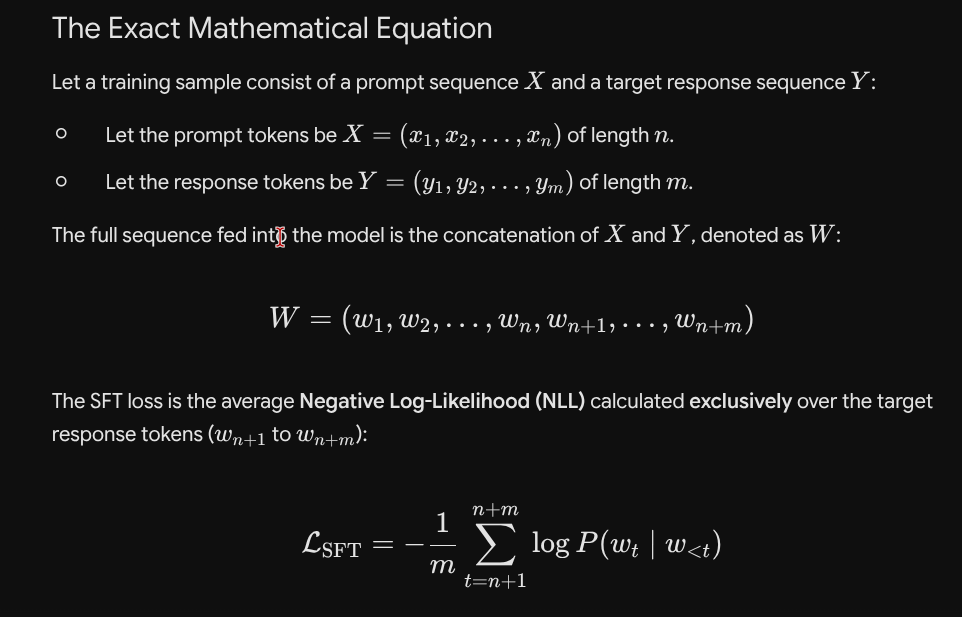
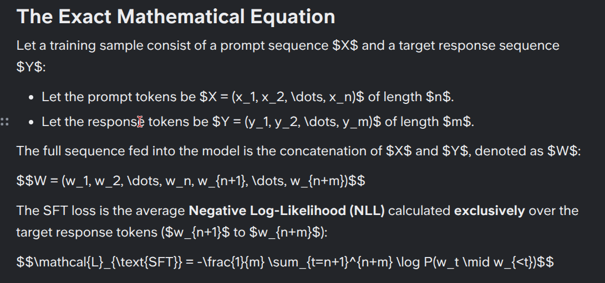
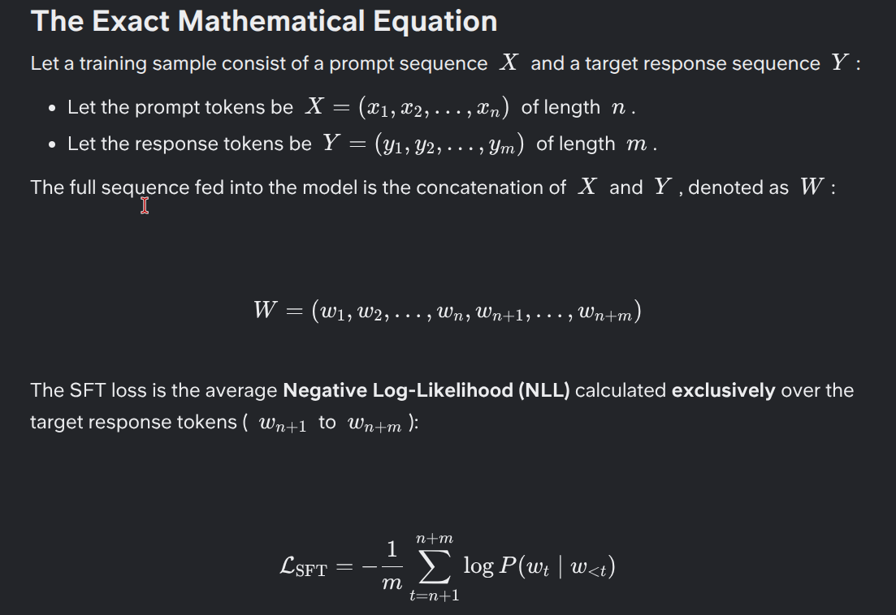

# LLMime 🧠📋

> **Zero-click, zero-shortcuts clipboard bridge that converts LLM-generated Markdown into native, fully editable rich text in your note-taking app.**

---

## The Problem

When you copy an answer from **Gemini, ChatGPT, or Claude** and paste it into **Slite** (or similar tools), the rich formatting is completely destroyed:

| What the LLM outputs | What lands in your notes |
|---|---|
| Beautiful LaTeX equations (`$$E=mc^2$$`) | Ugly raw string `$$E=mc^2$$` |
| Fenced code blocks with syntax highlighting | Plain inline text with weird pill badges |
| Bold headers and bullet lists | Mostly intact, but equations break surrounding text |

**The result is high-friction manual cleanup every single time.**

### Before LLMime


*This is the raw LLM output — beautifully formatted in the chat UI.*

---



*After Ctrl+C → Ctrl+V into Slite. Every equation is a raw string. Code blocks are individual pill-styled lines instead of a unified block.*

---

### After LLMime


*With LLMime running in the background: equations are native, editable math blocks. Code blocks have syntax highlighting. Zero extra clicks.*

---

## How It Works

LLMime runs as a **silent background daemon** on your Linux *or* Windows desktop. It hooks into the system clipboard and intercepts every copy event. (See [Windows Installation](#windows-installation) and [Operating System Targets](#-operating-system-targets) for platform details.)

```
Ctrl+C  →  Daemon detects $$, $, or ``` in the clipboard
        →  Parses the Markdown into Slite's native SlateJS AST
        →  Packs the AST into Slite's binary clipboard format
        →  Writes back to clipboard (< 50ms)
Ctrl+V  →  Slite reads native data → renders perfectly
```

The key insight is that **Slite reads the `chromium/x-web-custom-data` MIME type** from the clipboard — the same binary format it uses internally to copy/paste between documents. LLMime generates this binary payload from scratch, making the pasted content indistinguishable from content created natively inside Slite.

A **system tray icon** (indigo clipboard badge) shows that the daemon is active. A brief **toast notification** in the bottom-right of your screen confirms each successful conversion.

---

## Supported Formatting

| Markdown Element | Slite Output |
|---|---|
| `$$...$$` block math | Native editable formula block |
| `$...$` inline math | Native editable inline formula |
| ` ```python ... ``` ` fenced code | Native code block with language syntax highlighting |
| `# ## ###` headers | Native H1/H2/H3 heading blocks |
| `**bold**` / `*italic*` | Bold / Italic rich text |
| `- item` unordered lists | Native bulleted list blocks |
| `1. item` ordered lists | Native numbered list blocks |

---

## Installation

### Linux Installation

#### Prerequisites

```bash
# System dependencies
sudo apt install python3 python3-venv xclip

# Confirm X11 session (required — Wayland not yet supported)
echo $XDG_SESSION_TYPE  # should print: x11
```

#### Setup

```bash
git clone https://github.com/YOUR_USERNAME/LLMime.git
cd LLMime

# Create virtual environment
python3 -m venv venv
source venv/bin/activate

# Install Python dependencies
pip install -r requirements.txt
```

#### Build & Deploy

```bash
./build.sh
```

This script will:
1. Compile the daemon into a standalone binary via PyInstaller (`dist/daemon`).
2. Remove any old systemd service from previous versions.
3. Register a **Desktop Autostart** entry (`~/.config/autostart/llmime.desktop`) so LLMime launches automatically on login.
4. Register a **Desktop Launcher** entry (`~/.local/share/applications/llmime.desktop`) so you can search for and launch **"LLMime Clipboard Bridge"** from your application menu.
5. Start the daemon immediately.

### Windows Installation

The Windows daemon (`daemon_windows.py`) has full feature parity with Linux. It shares the same Markdown→Slite compiler (`compiler.py`) but writes the clipboard through the native Win32 API, because Windows keys clipboard formats by registered name rather than by MIME string. See [`TECHNICAL_SPEC_V2.md`](TECHNICAL_SPEC_V2.md) Section 6 for the full rationale.

#### Prerequisites
* Windows 10/11
* Python 3.x (the [`py` launcher](https://www.python.org/downloads/windows/) is recommended)

#### Build & Deploy

From the repo root in PowerShell:

```powershell
.\build_windows.ps1
```

This script will:
1. Create a Windows virtual environment (`venv-win`) and install `requirements-windows.txt` (which adds **`pywin32`**) plus PyInstaller.
2. Build a standalone windowed executable at `dist\LLMime.exe` (`--onefile --noconsole`).
3. Register **autostart** via a shortcut in your Startup folder (`shell:startup`) so LLMime launches on login.
4. Start the daemon immediately (look for the indigo **L** icon in your system tray).

> **Diagnostics:** `dump_clipboard_win.py` is a native Win32 clipboard inspector. Copy a block from Slite, run `py dump_clipboard_win.py`, and confirm the `Chromium Web Custom MIME Data Format` entry — useful for verifying Slite's schema on your machine.

### Usage

Once deployed, **just use your computer normally:**

1. Ask Gemini / ChatGPT / Claude anything with math or code.
2. Highlight the response and press `Ctrl+C`.
3. Switch to Slite and press `Ctrl+V`.
4. ✨ Equations and code blocks render as native, editable content.

**To quit:** Right-click the indigo **L** icon in your system tray → **Quit LLMime**.

**To relaunch:** Search for **"LLMime Clipboard Bridge"** in your application menu.

---

## Technical Deep-Dive

### The Core Discovery: `chromium/x-web-custom-data`

Slite (like many Electron-based apps) stores its rich clipboard data in a **custom Chromium binary MIME type** — `chromium/x-web-custom-data`. This is a binary dictionary format (similar to a Pickle) containing two keys:

- `application/x-slite-global` — A JSON string containing the full SlateJS AST fragment.
- `application/x-slite-semantic-xml` — An XML string mirroring the AST for fallback rendering.

The AST is built around a hierarchy of block and inline nodes. For example, a code block looks like:

```json
{
  "type": "code-blocks",
  "wrapCode": false,
  "children": [
    { "type": "code-block", "language": "python", "children": [{"text": "import torch"}] },
    { "type": "code-block", "language": "python", "children": [{"text": "import torch.nn as nn"}] }
  ]
}
```

And an inline math formula sits inside a paragraph block:

```json
{
  "type": "unstyled",
  "children": [
    { "text": "Let " },
    { "type": "inline-formula", "formula": "x", "children": [{"text": ""}] },
    { "text": " be a real number." }
  ]
}
```

LLMime generates this structure by:
1. **Splitting** the markdown on `$$` delimiters to isolate block math before anything else.
2. **Shielding** inline `$...$` with alphanumeric placeholders to protect them from the Python Markdown parser (which would corrupt underscores and asterisks inside equations).
3. **Parsing** the remaining markdown to HTML via the Python `markdown` library.
4. **Walking** the HTML element tree (`xml.etree.ElementTree`) and mapping each element to its SlateJS AST equivalent.
5. **Restoring** the shielded math placeholders as `inline-formula` nodes during the tree walk.
6. **Packing** the final AST + semantic XML into the Chromium binary format using Python's `struct` module.

---

## Known Limitations

| Issue | Status |
|---|---|
| **Wayland** — PyQt clipboard monitoring requires X11 or XWayland | Known — Wayland requires a separate `wl-paste --watch` pipeline |
| **Notion** — Notion's React editor does not hydrate from pasted HTML or custom clipboard AST | Paused — requires reverse-engineering Notion's own custom MIME payload |
| **Tables** — GFM pipe tables fall back to plain text | Not yet implemented |
| **Mermaid.js diagrams** — ` ```mermaid ``` ` blocks not converted | Not yet implemented |
| **Partial delimiters** — Copying a snippet with an unmatched `$$` may fail silently | Known edge case |

---

## Future Directions

### 🗒️ Note-Taking Platform Targets
| Platform | Status | Notes |
|---|---|---|
| **Slite** | ✅ Working | Native AST injection via `chromium/x-web-custom-data` |
| **Notion** | ⏸️ Paused | Needs reverse-engineering of Notion's Electron clipboard payload |
| **Obsidian** | 🔜 Planned | Obsidian uses raw Markdown files — direct paste of LaTeX delimiters into its own format should be feasible |
| **Confluence** | 🔜 Planned | Atlassian uses a rich JSON storage model; similar reverse-engineering approach |
| **Coda** | 🔜 Planned | Custom block model |

### 💬 LLM Chat Platform Targets
The daemon currently works with any LLM source (browser-based or desktop). Future enhancements could include:
- **Context-aware source detection:** Read `chromium/x-source-url` from the clipboard to apply platform-specific transformations (e.g. stripping ChatGPT-specific wrapper elements before parsing).
- **Native desktop app support:** Since Gemini and ChatGPT desktop clients often use Electron internally, the same clipboard inspection approach can be extended to support them.
- **Streaming paste:** Intercept partial clipboard updates during streaming LLM responses.

### 🖥️ Operating System Targets
| Platform | Status | Notes |
|---|---|---|
| **Linux (X11)** | ✅ Working | Full support — PyQt6 clipboard hooks work natively |
| **Windows** | ✅ Working | `daemon_windows.py` — native Win32 clipboard write under the `Chromium Web Custom MIME Data Format` name. End-to-end verified; paste into the Slite Windows app pending confirmation (see Spec §6.4) |
| **Linux (Wayland)** | 🚧 In Progress | Replace PyQt clipboard with `wl-paste --watch` + `wl-copy` pipeline |
| **macOS** | 🔜 Planned | Use `NSPasteboard` via PyObjC, or port to a Swift helper process |

---

## Project Structure

```
LLMime/
├── compiler.py                      # OS-independent core: Markdown→Slite AST compiler + Chromium binary packer
├── daemon.py                        # Linux daemon: clipboard bridge (X11) + tray icon + toast
├── daemon_windows.py                # Windows daemon: native Win32 clipboard write + tray icon + toast
├── build.sh                         # Linux build (PyInstaller) + register autostart desktop launchers
├── build_windows.ps1                # Windows build (PyInstaller) + register Startup-folder autostart
├── requirements.txt                 # Linux dependencies: PyQt6, Markdown
├── requirements-windows.txt         # Windows dependencies: PyQt6, Markdown, pywin32
├── dump_electron.py                 # Debug utility (Linux/Qt): dump raw clipboard MIME formats
├── dump_clipboard_win.py            # Debug utility (Windows/Win32): enumerate true clipboard format names
├── test_markdown_ast.py             # Sandbox: test AST compiler output without running full daemon
├── test_slate_inject.py             # Sandbox: manually inject a test Slite AST into clipboard
├── TECHNICAL_SPEC_V2.md             # Comprehensive technical specification with failure modes
├── LLM_to_Notion_Product_Overview.md# Product overview and pivot documentation
├── IDEOLOGY.md                      # Philosophy: continuous documentation and self-learning context
├── LLM_output.png                   # Screenshot: raw LLM output
├── slite_bad.png                    # Screenshot: broken paste without LLMime
└── slite_good.png                   # Screenshot: perfect paste with LLMime
```

---

## Development

To test the AST compiler without rebuilding the full binary:

```bash
source venv/bin/activate
python test_markdown_ast.py
```

To inspect what's on the clipboard (useful for reverse-engineering new editor formats):

```bash
source venv/bin/activate
python dump_electron.py
```

On **Windows**, use the native inspector instead (it shows the true Win32 format names that the Qt-based dumper hides):

```powershell
py dump_clipboard_win.py
```

---

## Documentation Philosophy

This project follows a **Living Specification** model — see [IDEOLOGY.md](IDEOLOGY.md). Every major architectural pivot is immediately documented in [TECHNICAL_SPEC_V2.md](TECHNICAL_SPEC_V2.md), including what failed and why, so that any developer (or AI agent) can resume work without repeating past mistakes.

---

## License

MIT
